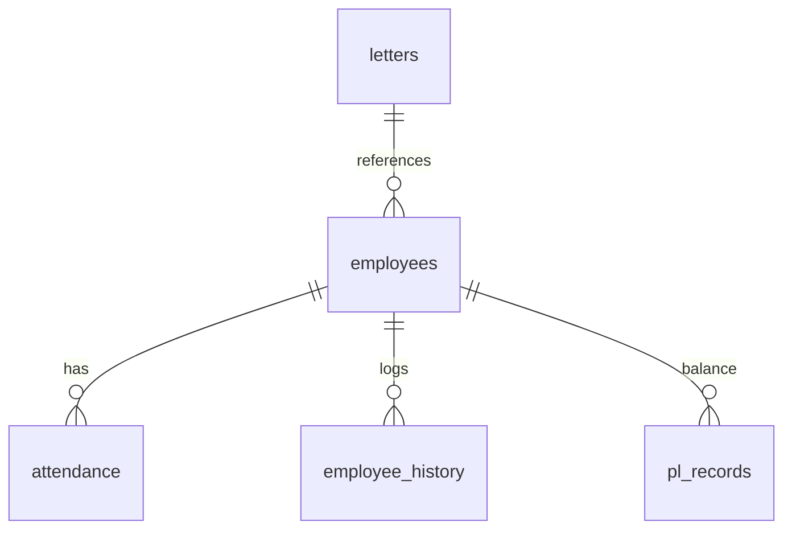

# HRMS PRO MAX: Systems Architecture & Technical Blueprint (PROJECT_REPORT2)

This document serves as the master systems blueprint, technical report, and modular audit guide for **HRMS Pro Max** (Product Name: *Employee Management System*). It outlines the architecture, database schema, inter-process communication flow, state engine, business logic, design tokens, and modularity metrics.

---

## 1. PROJECT OVERVIEW

* **Application Name**: placeholder-model-2 (Product Name: **Employee Management System**)
* **Environment**: Desktop Application (Electron Wrapper + React Frontend)
* **Build System**: Vite + TypeScript
* **Target Audience**: Administrative and HR Personnel at *Head Office Jaipur*
* **Core Functions**:
  * Comprehensive personnel record management (directories, active status, resigned/separated registry).
  * High-density monthly attendance tracking with a virtualized **Pulse Grid**.
  * Automated privilege leave (PL) ledgering, leaveSurrender tracks, and monthly allowances.
  * System-wide bilingual support (English/Hindi) with instant hot-swapping.
  * Multi-layer relational database logging with native audit trails.

### Core Technology Stack
| Framework / Library | Version | Purpose |
|---------------------|---------|---------|
| `react` | `^19.2.0` | Declarative UI views and component hierarchy |
| `framer-motion` | `^12.38.0` | Fluid CSS-backed spring animations and transitions |
| `zustand` | `^5.0.13` | Global state management (employee collections, attendance sheets) |
| `react-router-dom` | `^7.13.1` | Declarative client-side routing |
| `bootstrap` | `^5.3.8` | Grid layout, floating fields, and utility alignment classes |
| `sqlite3` | `^6.0.1` | Local transactional database storage |
| `electron` | `^41.5.0` | Desktop shell wrapper providing native operating system integration |

---

## 2. DIRECTORY STRUCTURE

The repository is modularly segmented, cleanly isolating database operations and UI rendering concerns:

```text
c:\Users\manag\Downloads\Employee Management System\src
├── App.tsx                    # Top-level entry with routes, AnimatedRoutes wrapper
├── index.css                  # Global styles, Tailwind-like utility tokens, scroll-bars
├── main.tsx                   # Main entry point mounting the React application
│
├── assets/                    # Static assets, logos, and global design styles
│   └── styles/
│       ├── themes.css         # Theme specific CSS tokens (light vs. dark)
│       └── tokens.css         # Master spacing, shadows, and core typography definitions
│
├── components/                # Common reusable UI components
│   ├── ui/                    # Virtualized Shadcn-like primitive elements (dialog, input, sheets)
│   ├── charts/                # Dynamic statistics charts (BarChart, DonutChart)
│   ├── StatCard.tsx           # Glassmorphic statistic card with hover spring transitions
│   └── LoadingStates.tsx      # Skeleton screens, page loaders, spinner overlays
│
├── core-ui/                   # Enterprise framework high-level templates
│   ├── forms/                 # Floating-label form inputs (FloatingFields.tsx)
│   ├── layout/                # Master window scaffold (MainLayout.tsx, Sidebar, Navbar)
│   ├── navigation/            # Collapsible Sidebar and Navbar
│   └── tables/                # High-performance virtualization widgets (EnterpriseTable.tsx)
│
├── lib/                       # Core system contexts and business utilities
│   ├── translations.ts        # English <-> Hindi key/value dictionary mappings
│   ├── fetchPolyfill.ts       # Maps standard fetch() directly to IPC channels
│   ├── categoryUtils.ts       # Category label and color helpers (permanent, contract)
│   ├── attendanceConfig.ts    # Attendance status options, codes, and payable day algorithms
│   └── payrollEngine.ts       # Monthly salary and allowance formula calculators
│
├── modules/                   # Feature-specific workflows
│   ├── attendance/            # Pulse Grid pages, StatusPopup modules
│   └── employees/             # Personnel registration forms, detail cards, profiles
│
├── pages/                     # Top-level view templates
│   ├── Dashboard.tsx          # Summary stats, audit timelines, quick actions
│   ├── Employees.tsx          # Central personnel search directory
│   ├── PLManagement.tsx       # Leave balance and surrender logs
│   ├── Letters.tsx            # Official letter and circular archive
│   └── Resigned.tsx           # History of separated/resigned personnel
│
└── stores/                    # Lightweight reactive Zustand stores
    ├── employeeStore.ts       # State store for personnel data and category filters
    └── attendanceStore.ts     # State store for monthly attendance registers
```

---

## 3. DATABASE MODELS & SCHEMA (SQLITE)

Data is persisted in an SQLite database instance dynamically initialized within the user's OS directory: `app.getPath('userData')`. 



### 1. `employees` (Personnel Directory)
Stores all core biographical, official, and salary indicators for active staff:
* `id` (TEXT, PRIMARY KEY): Unique UUID string.
* `employee_code` (TEXT, UNIQUE): Formatted administrative string (e.g., HOJ-0021).
* `name` (TEXT): Employee's full name.
* `mobile_number` (TEXT): Primary contact number.
* `department` (TEXT): Operational unit (e.g., Accounts, IT, Logistics).
* `designation` (TEXT): Administrative title.
* `joining_date` (TEXT): IS0-8601 string.
* `category` (TEXT): Contract type (`Permanent`, `Probationary`, `Contractual`, `Casual`).
* `is_active` (INTEGER): Binary toggle (`1` for active, `0` for soft-deleted).

### 2. `attendance` (Daily Logs)
* `employee_id` (TEXT, FOREIGN KEY ➔ `employees.id`): Associated employee record.
* `date` (TEXT): ISO format (YYYY-MM-DD).
* `status` (TEXT): Short status codes representing hours:
  * `present` (`P`): Core attendance.
  * `absent` (`A`): Zero hours.
  * `pl` (`PL`): Privilege Leave (deducted from PL balance).
  * `cl` (`CL`): Casual Leave.
  * `half_cl` (`HCL`): 0.5 day deduction.
  * `weekly_off` (`WO`): Standard weekend rest.

### 3. `employee_history` (Audit Log)
Automatic system-wide logs triggered on any mutation to track compliance and history:
* `id` (INTEGER, PRIMARY KEY AUTOINCREMENT).
* `employee_id` (TEXT, FOREIGN KEY): Key referencing modified employee.
* `action` (TEXT): Mutation operation (`CREATE`, `UPDATE`, `DELETE`, `CATEGORY_CHANGE`).
* `old_values` (TEXT): JSON-serialized representation of values before update.
* `new_values` (TEXT): JSON-serialized representation of values after update.
* `timestamp` (TEXT): UTC datetime string.

### 4. `pl_records` (Privilege Leave Ledger)
* `id` (INTEGER, PRIMARY KEY AUTOINCREMENT).
* `employee_id` (TEXT, FOREIGN KEY): Target employee.
* `year` (INTEGER) / `month` (INTEGER).
* `opening_balance` (REAL): PL count at beginning of month.
* `earned` (REAL): Monthly credited PL (standard: 1.25 per month for permanent staff).
* `availed` (REAL): Deducted PL (from `attendance` PL status).
* `closing_balance` (REAL): Calculated closing count.
* `surrendered` (REAL): Track PL balance converted into financial allowances.

---

## 4. INTER-PROCESS COMMUNICATION (IPC)

React frontend communicates securely with the native Electron backend via a dual-layer IPC bridge:

```text
+-------------------------------------------------------------+
|                      REACT UI FRONTEND                      |
|  - Calls fetch('http://api.local/employees', { ... })        |
+-------------------------------------------------------------+
                               |
                               v
+-------------------------------------------------------------+
|                     FETCH POLYFILL BRIDGE                   |
|  - Intercepts requests in src/lib/fetchPolyfill.ts          |
|  - Translates URL endpoint directly to electronAPI.invoke   |
+-------------------------------------------------------------+
                               |
                               v
+-------------------------------------------------------------+
|                      ELECTRON PRELOAD                       |
|  - electron/preload.cjs exposes electronAPI.invoke to window|
+-------------------------------------------------------------+
                               | (Secure IPC Tunnel)
                               v
+-------------------------------------------------------------+
|                     ELECTRON MAIN PROCESS                   |
|  - Registers ipcMain.handle('api:employees') inside api.cjs|
|  - Direct SQLite driver read/write execution                |
+-------------------------------------------------------------+
```

### IPC API Endpoint Mapping
* **`api:dashboard`**: Fetches aggregate personnel metrics, present ratio, active leave statistics, and recent letters.
* **`api:employees`**: Standard CRUD controller for the `employees` and `employee_history` database tables.
* **`api:attendance`**: Pulls attendance arrays for specific date intervals and updates daily cells in bulk.
* **`api:letters`**: Manages the official circular and correspondence archive metadata.
* **`api:resigned`**: Manages and returns the list of separated/resigned personnel who have left.
* **`api:pl-records`**: Triggers PL balance audits, leave surrender calculations, and ledger balance adjustments.

---

## 5. REACTIVE STATE ARCHITECTURE (ZUSTAND)

Modulations use Zustand to manage client-side state, preventing excessive component re-renders:

### `useEmployeeStore` (`src/stores/employeeStore.ts`)
```typescript
interface EmployeeState {
  employees: Employee[];
  loading: boolean;
  error: string | null;
  filters: { department: string; designation: string; search: string };
  fetchEmployees: () => Promise<void>;
  addEmployee: (emp: Partial<Employee>) => Promise<void>;
  updateEmployee: (id: string, emp: Partial<Employee>) => Promise<void>;
  softDeleteEmployee: (id: string) => Promise<void>;
}
```
* **Synchronization Strategy**: Triggers async API calls, updates the local cache, and notifies all subscribing page views on a single tick.

### `useAttendanceStore` (`src/stores/attendanceStore.ts`)
```typescript
interface AttendanceState {
  attendanceData: Record<string, Record<string, string>>; // YYYY-MM-DD -> empId -> Status
  loading: boolean;
  fetchMonthlyAttendance: (year: number, month: number) => Promise<void>;
  updateDailyStatus: (empId: string, date: string, status: string) => Promise<void>;
}
```
* **State Modularity**: Handles real-time matrix transformations, converting vertical flat rows returned by SQLite into standard rows where keys correspond to dates and columns represent employee IDs.

---

## 6. BUSINESS & COMPUTATION RULES

### 1. Category Transition & Change Reason Logic
* **Validation Rule**: If an employee has their category changed (e.g., from `Probationary` to `Permanent`), a mandatory `Change Reason` is required in the UI. 
* **Database Consistency**: Category change validation rules strictly enforce that once an employee's category becomes `Permanent`, it cannot be changed back, maintaining data integrity. Any valid modification writes the old/new category values directly into `employee_history`.

### 2. Pulse Grid Keybind Hotkeys
To enable high-speed data entry by HR staff, the attendance matrix supports instant numerical keybinds:
* `1` ➔ `Present` (`P`)
* `2` ➔ `Absent` (`A`)
* `3` ➔ `Privilege Leave` (`PL`)
* `4` ➔ `Casual Leave` (`CL`)
* `5` ➔ `Half Casual Leave` (`HCL`)
* `6` ➔ `Weekly Off` (`WO`)

### 3. Payroll and Payable Days Computations
The **`payrollEngine.ts`** calculates payable days by subtracting unpaid absences from the total calendar days:
$$\text{Payable Days} = \text{Calendar Days} - \text{Absent Days} - (0.5 \times \text{Half Casual Leave})$$
* **Standard Credits**: Permanent employees earn $1.25$ PL credits per month automatically, provided their monthly attendance shows less than 3 days of unauthorized unpaid absence.

---

## 7. DESIGN SYSTEM & VISUAL STYLE

The design system implements a premium **Glassmorphism UI** optimized for visual clarity, typography precision, and performance:

### Color Palette (HSL System)
* **Background (`--color-background`)**: `#020617` (Deep Midnight Slate)
* **Primary Header (`--color-primary`)**: `#0F172A` (Rich Dark Charcoal)
* **CTA Accent (`--color-cta`)**: `#22C55E` (Emerald Green)
* **Text Tone (`--color-text`)**: `#F8FAFC` (High-contrast Off-White)

### Typography
* **Headings**: `Fira Code` (Technical, precise, tabular alignment)
* **Body Font**: `Fira Sans` (High legibility, clean readability)
* **Bilingual rendering**: Noto Sans Devanagari (optimized line-heights specifically for Hindi script rendering in tables)

### Glassmorphic CSS Classes
```css
.glass-card {
  background: rgba(15, 23, 42, 0.45);
  backdrop-filter: blur(16px);
  border: 1px solid rgba(255, 255, 255, 0.08);
  box-shadow: var(--shadow-md);
  border-radius: 12px;
  transition: transform 200ms ease, box-shadow 200ms ease;
}

.glass-card:hover {
  transform: translateY(-2px);
  box-shadow: var(--shadow-lg);
  border-color: rgba(34, 197, 94, 0.3); /* Accent highlights */
}
```

---

## 8. GRAPH MODULARITY & CODE ANALYSIS

Our structural knowledge graph analysis yields key metrics on system dependencies, coupling, and modularity:

### Modularity Stats
* **Modularity Index**: **446 nodes · 647 edges · 53 detected communities**
* **Modularity Cohesion**: High density on core leaf components; light coupling across business domains.
* **Token Reduction Metric**: Graph-based contextual reasoning results in a **13.5x token reduction** compared to full-corpus analysis.

### Top Architectural Bridges (Betweenness Centrality)
1. **`cn()`** (Centrality: `0.529`): Central utility in Community 5 (UI Primitives & Tailwind Utilities). Almost all components hook into `cn()` to construct dynamic CSS classes.
2. **`PLManagement()`** (Centrality: `0.180`): Main bridge connecting Community 3 (Navigation & HR Forms) to Community 1 (Global State & API Services). Acts as a vital conceptual pathway in the codebase.
3. **`useLanguage()`** (Centrality: `0.134`): The translation conduit, connecting main layout blocks in Community 2 directly to navigation panels, forms, and data grids in Community 3.

---

*Document Author: HRMS Pro Max Core Architecture Team (Antigravity AI)*  
*Generated: 2026-05-19*
